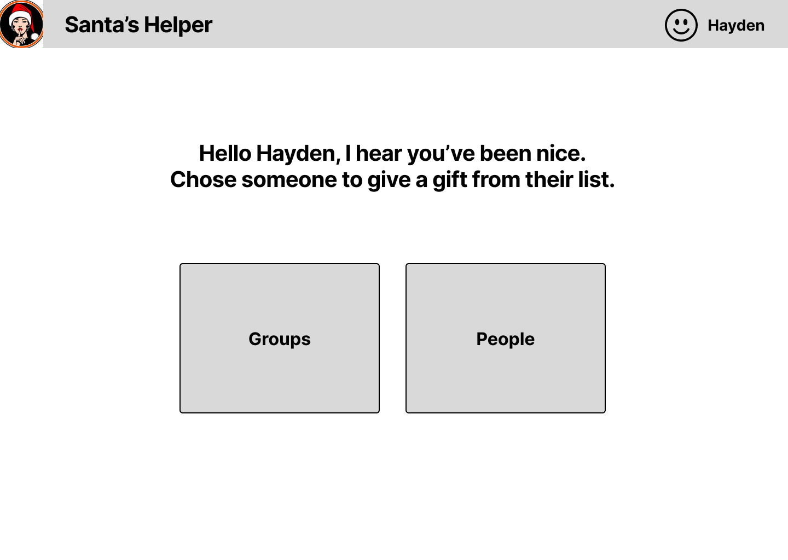

# Santa's List

As families gather together at Christmas, gift exchanges are not only common but necessary.

How do you know what to give loved ones? How do you know someone else hasn't already gifted the same thing you are wanting to give?

Introducing Santa's List. Gift lists amongst family and and friends to make the holiday's that much easier.

- Make your wish list and check it twice.
- Share your list with your group of loved ones.
- Reserve gifts you want to give from other lists in your group.
- Give the gift of gifts.

## Wireframe

## HTML
The calendar isn't as bad as they say. The default isn't bad.

## Things I learned from the Simon assignment and the html assignments
- Be deliberate with your html tags. There's a specific purpose, structure, and hierarchy.
- Make changes often, deploy often.
- Make smaller commits

## Javascript Simon
- Adding onClick events initialized the js, you can then add the .js at the bottom of the page.

## Node
- include node-modules in .gitignore

## Simon Service
- make sure and update your gitignore for your startup applicaiton
- your deployService sh file has changed. Make sure and run the chmod on the file to make it accessible.
- Simon app had a cool calc for the height "height: calc(100px + 1em);" in the css file.
- your index.js files don't speak to each other from the front end and backend.
- make sure your index file has the correct folder name passed in for express.static for your static files.
- watch the class video two more times.
- Simon is listening on 3000, but your app will be on 4000.

## Simon DB
- UUID ==== Universally Unique Identifier
- Cookies store session data
- Logging out removes the session cookie.
- Login and create user can happen at the same time.
- Logout removes the authentication cookies.
- you might have to log out and log in to restart env variables.

## Simon Login
- 404 === not found.
- 401 === auth error.
- denial of service attack attack is a type of cyber attack where an attacker seeks to disrupt the normal functioning of a website, server, or network by overwhelming it with a flood of traffic or requests. The attacker typically does this by using a large number of compromised computers, known as a botnet, to send a huge amount of traffic or requests to the target system, effectively causing it to become unavailable to legitimate users. DOS attacks take forms such as flooding the target system with fake requests, exploiting vulnerabilities in the target's software, or simply overwhelming the system's resources by consuming too much bandwidth or processing powe.
- Setting cookies is how authorization is possible.
- Cookies contian tokens, or name value pairs.

## Simon Websocket
- Update and superset of http
- Clients communicate to server, server talks back with updates from other clients.
- You can see the messages from web socket in tools > network > messages.
- Ping and Pong is what keeps the connection alive.

## Simon React
- hooks are functions that return values and functions to change the value.
- The class attribute is renamed to className so that it doesn't conflict with the JavaScript keyword class.
- Delete the header and footer HTML since they are now represented in app.jsx.
- Copy the JavaScript over and turn the functions into inner functions of the React component.
- When running in production, the Simon web service running under Node.js on port 3000 serves up the Simon React application code when the browser requests index.html. 

## Startup JS Take-Aways
- As for now, local storage is where the data is stored, but that will change.
- You can use JS to set the default state of the app is really helpful.
- Some instances the event listener needs to be added in the html.
- JS helps you template and update tables.
- You are able to do a lot by just updating local storage.

## Startup Service Take-Aways
- Debugging the WebSocket code was very difficult, but it taught me how to pass values between components.
    - I was mostly able to make progress by doing a lot of console.log statements in functions. That told me everything that wasn't getting hit.
- My project has notification for when a user adds and item to their list and when the remove an item to their list.
- The authentication routs were easiest managed with React. The Router made it much easier.
- I filtered the image coming image coming through using a tag for 'holidays'.
- I filtered the quote coming in using the 'love' tag.
- npm install to get the contents of you package-manger.

## Startup React Take-Aways
- Getting the React environment correct was the most difficult part of the entire project (maybe besides WebSocket idk).
    - Setting up the environment variables on a Mac is not fun.
    - The video to transfer the project to react was one of the most helpful things this semester. So many details are learned in that process. Difficult to teach some of those things without going through the motion and watching a pro (like what to delete from create-react-app).
- Routing is a very useful tool. I need to learn some more conditional routing.
- when passing with props, you can use a prop name without dot notation.
- Virtual dom is what re-renders components bases off of changes in prop data.
- Data flows from parent to child.
